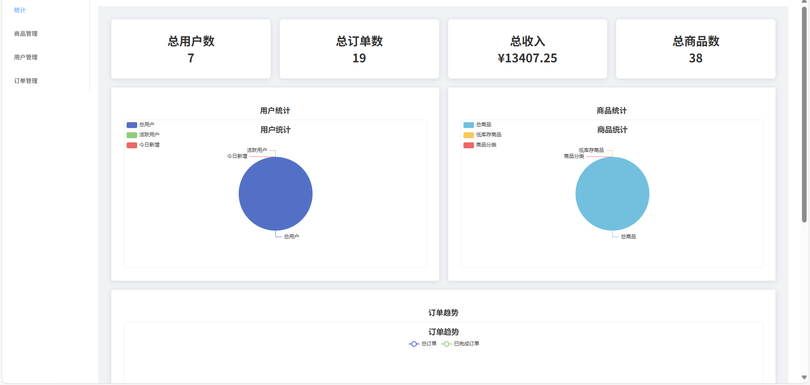

# ToeMall 电商系统

## 项目简介
ToeMall 是一个完整的电商网站系统，采用前后端分离架构设计，提供商品浏览、搜索、购物车、订单管理、用户认证等核心电商功能。

### 系统截图

#### 首页展示


#### 购物车页面


#### 订单页面


#### 搜索功能


#### 商品分类


#### 管理员界面



## 技术架构

### 前端技术栈
- **框架**: Vue.js 2.6.x
- **路由**: Vue Router 3.5.x
- **状态管理**: Vuex 3.6.x
- **UI组件库**: Element UI 2.15.x
- **HTTP请求**: Axios 1.8.x
- **工具库**: js-cookie 3.0.x
- **构建工具**: Vue CLI

### 后端技术栈
- **框架**: ASP.NET Core
- **ORM**: Entity Framework Core
- **数据库**: SQL Server
- **API设计**: RESTful API

## 系统功能模块

### 1. 用户认证与管理
- 用户注册、登录功能
- JWT Token身份验证机制
- 用户信息管理（含积分系统）
- 管理员权限控制

### 2. 商品管理
- 商品列表展示，支持分页、排序和筛选
- 商品详情查看
- 商品搜索功能
- 商品分类浏览

### 3. 分类管理
- 分类的增删改查（管理员功能）
- 商品按分类过滤

### 4. 购物车功能
- 添加/删除购物车商品
- 修改购物车商品数量
- 购物车结算

### 5. 订单管理
- 订单创建与查询
- 订单状态跟踪

### 6. 统计分析
- 销售数据统计

## 部署流程

### 前置条件
- 安装 .NET SDK 6.0 或更高版本
- 安装 Node.js 14.x 或更高版本
- 安装 SQL Server 数据库
- 安装 Git

### 1. 克隆代码库

```bash
# 克隆项目代码
git clone https://github.com/yourusername/ToeMall.git
cd ToeMall
```

### 2. 后端部署

#### 2.1 配置数据库连接

修改 `ToeMall/appsettings.json` 文件，配置数据库连接字符串：

```json
{
  "ConnectionStrings": {
    "DefaultConnection": "Server=your_server;Database=ToeMall;User Id=your_username;Password=your_password;TrustServerCertificate=True;"
  },
  "CustomSettings": {
    "pagination": {
      "defaultPageSize": 20,
      "maxPageSize": 100
    }
  }
}
```

#### 2.2 初始化数据库

使用项目提供的数据库备份文件 `toemall_backup.sql` 恢复数据库：

```bash
# 使用 SQL Server Management Studio 或命令行恢复数据库
# 命令行示例:
sqlcmd -S your_server -U your_username -P your_password -Q "RESTORE DATABASE ToeMall FROM DISK='d:\\GitHub\\ToeMall\\toemall_backup.sql' WITH REPLACE"
```

或者使用 Entity Framework Core 迁移：

```bash
cd ToeMall
# 添加迁移（如果需要）
dotnet ef migrations add InitialCreate
# 应用迁移
dotnet ef database update
```

#### 2.3 启动后端服务

```bash
cd ToeMall
# 构建项目
dotnet build
# 运行项目
dotnet run
```

后端服务默认运行在 `http://localhost:5000` 和 `https://localhost:5001`。

### 3. 前端部署

#### 3.1 安装依赖

```bash
cd ToeMall_vue
# 安装 npm 依赖
npm install
```

#### 3.2 配置API地址

修改 `ToeMall_vue/src/utils/request.js` 文件，设置API基础URL：

```javascript
// request.js 中的 baseURL 配置
const service = axios.create({
  baseURL: 'http://localhost:5000/api', // 后端API基础地址
  timeout: 10000
})
```

#### 3.3 开发环境运行

```bash
# 启动开发服务器
npm run serve
```

开发服务器默认运行在 `http://localhost:8080`。

#### 3.4 生产环境构建

```bash
# 构建生产环境代码
npm run build
```

构建后的文件将生成在 `dist` 目录中，可以部署到任何静态文件服务器。

### 4. 生产环境部署

#### 4.1 部署后端

使用 IIS 部署 .NET Core 应用：

1. 安装 .NET Core Hosting Bundle
2. 在 IIS 中创建网站，指向 `ToeMall/bin/Release/net6.0/publish` 目录
3. 配置应用程序池为无托管代码
4. 设置环境变量或修改 appsettings.Production.json

#### 4.2 部署前端

1. 将构建好的 `dist` 目录内容复制到 Web 服务器
2. 配置 Nginx/Apache 等 Web 服务器：

```nginx
server {
    listen 80;
    server_name example.com;

    location / {
        root /path/to/dist;
        index index.html;
        try_files $uri $uri/ /index.html;
    }

    location /api {
        proxy_pass http://localhost:5000;
        proxy_http_version 1.1;
        proxy_set_header Upgrade $http_upgrade;
        proxy_set_header Connection keep-alive;
        proxy_set_header Host $host;
        proxy_cache_bypass $http_upgrade;
        proxy_set_header X-Forwarded-For $proxy_add_x_forwarded_for;
        proxy_set_header X-Forwarded-Proto $scheme;
    }
}
```

### 5. 环境变量配置

#### 后端环境变量
- `ConnectionStrings__DefaultConnection`: 数据库连接字符串
- `CustomSettings__pagination__defaultPageSize`: 默认分页大小
- `CustomSettings__pagination__maxPageSize`: 最大分页大小
- `ASPNETCORE_ENVIRONMENT`: 环境变量（Development/Staging/Production）

#### 前端环境变量
在 `.env` 文件中配置：

```
# 开发环境
VUE_APP_API_BASE_URL=http://localhost:5000/api

# 生产环境 (.env.production)
VUE_APP_API_BASE_URL=http://api.example.com
```

### 6. 常见问题排查

1. **数据库连接失败**
   - 检查连接字符串是否正确
   - 确认数据库服务是否正在运行
   - 验证数据库用户权限

2. **API调用失败**
   - 检查前后端地址是否配置正确
   - 确认CORS设置是否允许跨域请求
   - 查看网络请求日志和错误信息

3. **Token认证问题**
   - 检查Token是否正确生成和传递
   - 确认Token验证中间件配置
   - 检查Token过期时间设置

4. **前端页面白屏**
   - 确认构建文件是否正确
   - 检查路由配置
   - 查看浏览器控制台错误

## 项目结构

### 前端结构
```
ToeMall_vue/
├── public/             # 静态资源
├── src/                # 源代码
│   ├── api/            # API接口封装
│   ├── assets/         # 图片、图标等资源
│   ├── components/     # 公共组件
│   ├── views/          # 页面组件
│   ├── router/         # 路由配置
│   ├── store/          # Vuex状态管理
│   ├── utils/          # 工具函数
│   ├── App.vue         # 根组件
│   └── main.js         # 入口文件
├── .env                # 环境变量
├── babel.config.js     # Babel配置
├── package.json        # 项目依赖
├── vue.config.js       # Vue CLI配置
└── README.md           # 前端说明文档
```

### 后端结构
```
ToeMall/
├── Controllers/        # API控制器
├── Data/               # 数据库上下文
├── Middlewares/        # 中间件
├── Models/             # 数据模型
├── Utils/              # 工具类
├── appsettings.json    # 应用配置
├── Program.cs          # 程序入口
└── ToeMall.csproj      # 项目文件
```

## 许可证
MIT License

## 联系方式
如有问题，请提交Issue或联系项目维护者。