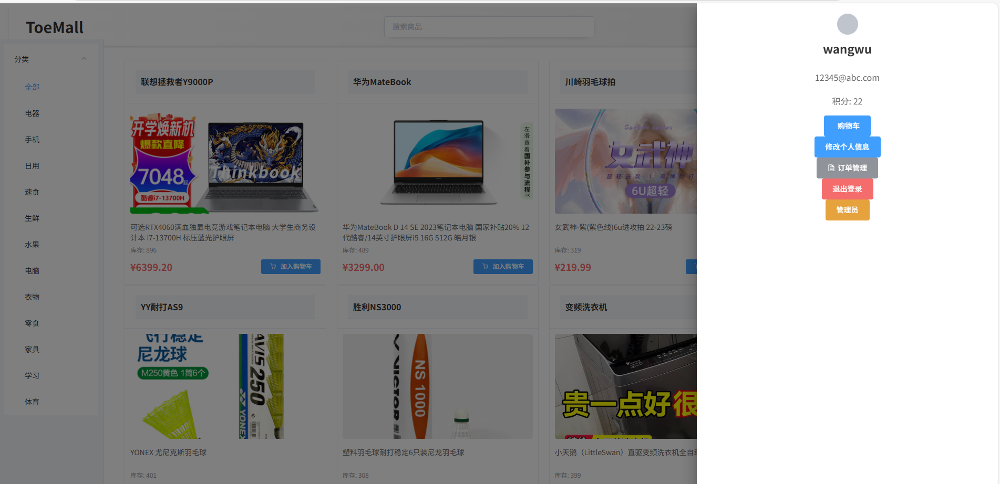
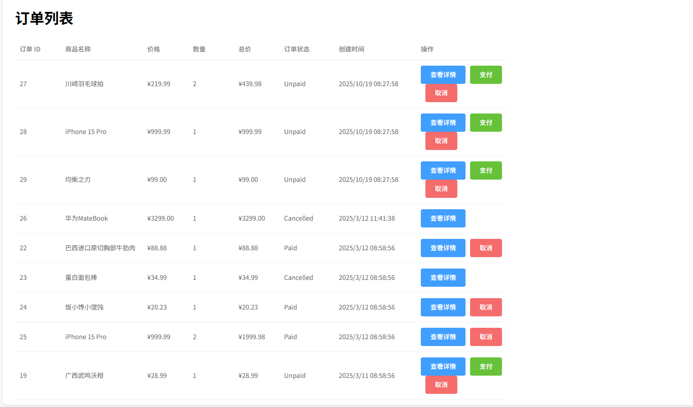
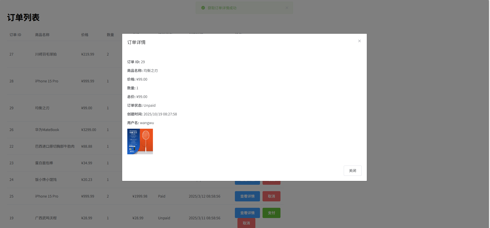
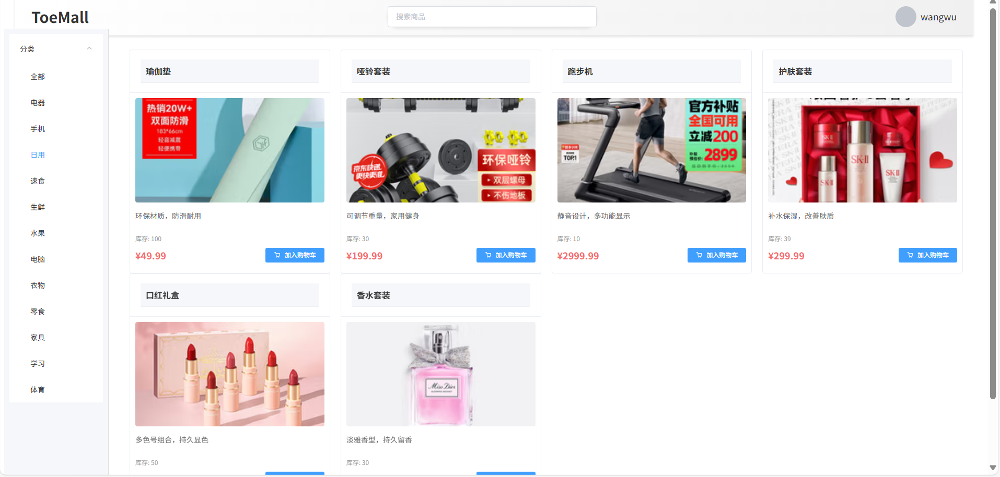
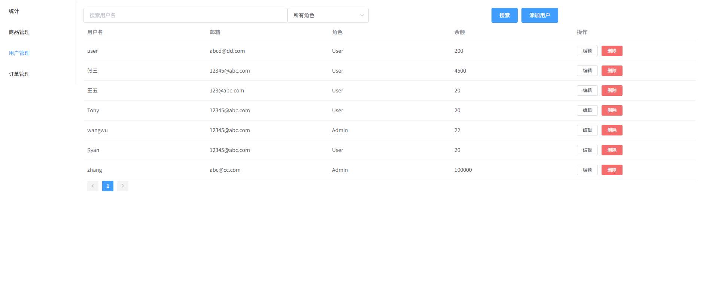

# ToeMall E-commerce System

## Project Introduction

ToeMall is a complete e-commerce website system designed with a front-end and back-end separated architecture, providing core e-commerce functions such as product browsing, searching, shopping cart, order management, and user authentication.

### System Screenshots

#### Homepage



#### Shopping Cart


#### Order Pages



#### Search Function


#### Product Categories


#### Admin Interface




## Technical Architecture

### Front-end Technology Stack

- **Framework**: Vue.js 2.6.x
- **Routing**: Vue Router 3.5.x
- **State Management**: Vuex 3.6.x
- **UI Component Library**: Element UI 2.15.x
- **HTTP Requests**: Axios 1.8.x
- **Utility Library**: js-cookie 3.0.x
- **Build Tool**: Vue CLI

### Back-end Technology Stack

- **Framework**: ASP.NET Core
- **ORM**: Entity Framework Core
- **Database**: SQL Server
- **API Design**: RESTful API

## System Function Modules

### 1. User Authentication and Management

- User registration and login functionality
- JWT Token authentication mechanism
- User information management (including points system)
- Administrator permission control

### 2. Product Management

- Product list display with pagination, sorting, and filtering
- Product details view
- Product search functionality
- Product category browsing

### 3. Category Management

- Category CRUD operations (administrator functionality)
- Product filtering by category

### 4. Shopping Cart Functionality

- Add/remove shopping cart items
- Modify shopping cart item quantities
- Shopping cart checkout

### 5. Order Management

- Order creation and querying
- Order status tracking

### 6. Statistical Analysis

- Sales data statistics

## Deployment Process

### Prerequisites

- Install .NET SDK 6.0 or higher
- Install Node.js 14.x or higher
- Install SQL Server database
- Install Git

### 1. Clone the Code Repository

```bash
# Clone project code
git clone https://github.com/yourusername/ToeMall.git
cd ToeMall
```

### 2. Back-end Deployment

#### 2.1 Configure Database Connection

Modify the `ToeMall/appsettings.json` file to configure the database connection string:

```json
{
  "ConnectionStrings": {
    "DefaultConnection": "Server=your_server;Database=ToeMall;User Id=your_username;Password=your_password;TrustServerCertificate=True;"
  },
  "CustomSettings": {
    "pagination": {
      "defaultPageSize": 20,
      "maxPageSize": 100
    }
  }
}
```

#### 2.2 Initialize Database

Restore the database using the provided database backup file `toemall_backup.sql`:

```bash
# Use SQL Server Management Studio or command line to restore the database
# Command line example:
sqlcmd -S your_server -U your_username -P your_password -Q "RESTORE DATABASE ToeMall FROM DISK='d:\\GitHub\\ToeMall\\toemall_backup.sql' WITH REPLACE"
```

Or use Entity Framework Core migrations:

```bash
cd ToeMall
# Add migration (if needed)
dotnet ef migrations add InitialCreate
# Apply migration
dotnet ef database update
```

#### 2.3 Start Back-end Service

```bash
cd ToeMall
# Build the project
dotnet build
# Run the project
dotnet run
```

The back-end service runs by default at `http://localhost:5000` and `https://localhost:5001`.

### 3. Front-end Deployment

#### 3.1 Install Dependencies

```bash
cd ToeMall_vue
# Install npm dependencies
npm install
```

#### 3.2 Configure API Address

Modify the `ToeMall_vue/src/utils/request.js` file to set the API base URL:

```javascript
// baseURL configuration in request.js
const service = axios.create({
  baseURL: 'http://localhost:5000/api', // Backend API base address
  timeout: 10000
})
```

#### 3.3 Run in Development Environment

```bash
# Start development server
npm run serve
```

The development server runs by default at `http://localhost:8080`.

#### 3.4 Build for Production Environment

```bash
# Build production-ready code
npm run build
```

The built files will be generated in the `dist` directory and can be deployed to any static file server.

### 4. Production Environment Deployment

#### 4.1 Deploy Back-end

Deploy .NET Core application using IIS:

1. Install .NET Core Hosting Bundle
2. Create a website in IIS pointing to the `ToeMall/bin/Release/net6.0/publish` directory
3. Configure the application pool to use No Managed Code
4. Set environment variables or modify appsettings.Production.json

#### 4.2 Deploy Front-end

1. Copy the contents of the built `dist` directory to the web server
2. Configure Nginx/Apache web server:

```nginx
server {
    listen 80;
    server_name example.com;

    location / {
        root /path/to/dist;
        index index.html;
        try_files $uri $uri/ /index.html;
    }

    location /api {
        proxy_pass http://localhost:5000;
        proxy_http_version 1.1;
        proxy_set_header Upgrade $http_upgrade;
        proxy_set_header Connection keep-alive;
        proxy_set_header Host $host;
        proxy_cache_bypass $http_upgrade;
        proxy_set_header X-Forwarded-For $proxy_add_x_forwarded_for;
        proxy_set_header X-Forwarded-Proto $scheme;
    }
}
```

### 5. Environment Variable Configuration

#### Back-end Environment Variables

- `ConnectionStrings__DefaultConnection`: Database connection string
- `CustomSettings__pagination__defaultPageSize`: Default pagination size
- `CustomSettings__pagination__maxPageSize`: Maximum pagination size
- `ASPNETCORE_ENVIRONMENT`: Environment variable (Development/Staging/Production)

#### Front-end Environment Variables

Configure in `.env` file:

```
# Development environment
VUE_APP_API_BASE_URL=http://localhost:5000/api

# Production environment (.env.production)
VUE_APP_API_BASE_URL=http://api.example.com
```

### 6. Troubleshooting Common Issues

1. **Database Connection Failure**
   
   - Check if the connection string is correct
   - Confirm if the database service is running
   - Verify database user permissions

2. **API Call Failure**
   
   - Check if the front-end and back-end addresses are configured correctly
   - Confirm if CORS settings allow cross-origin requests
   - Check network request logs and error messages

3. **Token Authentication Issues**
   
   - Check if tokens are correctly generated and passed
   - Confirm token validation middleware configuration
   - Check token expiration time settings

4. **Front-end Blank Page**
   
   - Confirm if build files are correct
   - Check routing configuration
   - View browser console errors

## Project Structure

### Front-end Structure

```
ToeMall_vue/
├── public/             # Static resources
├── src/                # Source code
│   ├── api/            # API interface encapsulation
│   ├── assets/         # Images, icons and other resources
│   ├── components/     # Common components
│   ├── views/          # Page components
│   ├── router/         # Routing configuration
│   ├── store/          # Vuex state management
│   ├── utils/          # Utility functions
│   ├── App.vue         # Root component
│   └── main.js         # Entry file
├── .env                # Environment variables
├── babel.config.js     # Babel configuration
├── package.json        # Project dependencies
├── vue.config.js       # Vue CLI configuration
└── README.md           # Front-end documentation
```

### Back-end Structure

```
ToeMall/
├── Controllers/        # API controllers
├── Data/               # Database context
├── Middlewares/        # Middleware
├── Models/             # Data models
├── Utils/              # Utility classes
├── appsettings.json    # Application configuration
├── Program.cs          # Program entry
└── ToeMall.csproj      # Project file
```

## License

MIT License

## Contact

For any questions, please submit an Issue or contact the project maintainers.